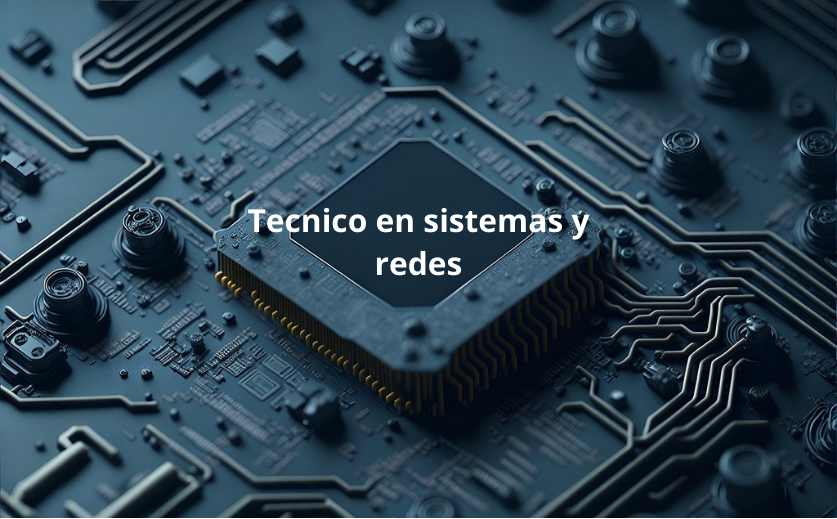

## Jordi Zalkaliani Profile
# 🧑‍💻 Estudiante de SMX | Perfil Tecnológico

## 💾 Sobre mí
Soy estudiante de **Sistemas Microinformáticos y Redes (SMX)**, interesado en sistemas, redes y tecnología.  
Me gusta aprender, montar equipos, solucionar problemas y entender cómo funciona todo por dentro.

## 🛠️ Tecnologías que manejo / estoy aprendiendo
- **Sistemas Operativos:** Windows, Linux (Ubuntu/Debian)
- **Redes:** TCP/IP, DNS, DHCP, topologías básicas
- **Programación:** Python (básico), Bash, PowerShell
- **Hardware:** Montaje, diagnóstico y mantenimiento de equipos
- **Web:** HTML, CSS

## 🛠️ Tecnologías y Herramientas

